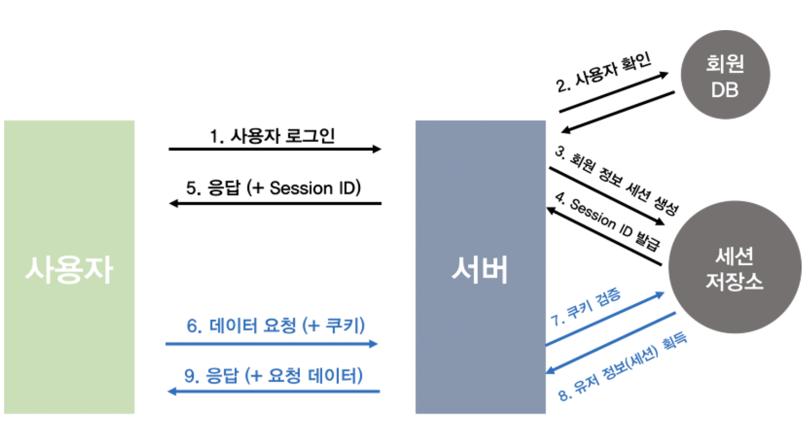

# JavaScript Practice

</br>

## 자바스크립트의 원시 타입의 개수와 종류

</br>
boolean, string, number, undefined , null , symbol 이렇게 6가지 종류
</br>
undefined는 선언만 되어있고 값은 없는 상태 , null은 자료형이 객체이며 빈값을 의미

</br>

---

</br>

## 실행 컨텍스트(Execution Context)란 ?

</br>

자바스크립트의 코드들이 실행되기 위한 환경

전역 컨텍스트 ,함수 컨텍스트 2가지 존재

전역 컨텍스트 하나 생성 후에 함수 호출할 때마다 함수 컨텍스트가 생성되며 콜스택에 push

컨텍스트를 생성시에 변수객체, 스코프 체인, this가 생성된다.

컨텍스트 생성 후 함수가 실행되는데 사용되는 변수들은 변수 객체 안에서 값을 찾고 없다면 스코프체인을 따라 올라가며 찾음.

함수 실행이 마무리되면 해당 컨텍스트는 사라짐. 페이지가 종료되면 전역 컨텍스트가 사라짐

즉, 자바스크립트의 코드가 실행되기 위해서는 변수객체, 스코프체인, this 정보들을 담고 있는 곳을 실행컨텍스트라고 부른다.

실행 컨텍스트가 콜스택에 쌓이면 실행 컨텍스트가 활성화 되어 자바스크립트 엔진이 해당 컨텍스트에 관련된 코드들을 실행하는 데 필요한 **환경정보**를 수집해서 실행컨텍스트 객체에 저장

</br>

### 담기는 정보 💡

</br>

- VariableEnvironment(변수 환경) : 현재 컨텍스트 내의 식별자 정보 + 환경정보가 담기며 최초 실행시의 스냅샷
- LexicalEnvironment(렉시컬 환경): 현재 컨텍스트 내의 식별자 정보 + 환경정보
- ThisBinding : This 식별자가 바라봐야할 대상 객체

</br>

변수 환경에 담기는 내용은 렉시컬 환경과 같지만 최초 실행시의 스냅샷을 유지한다는 점이 다르다.

</br>

실행컨텍스트를 생성할 때 변수환경에 먼저 담은 다음, 이를 그대로 복사해서 렉시컬 환경을 만들고 이후에는 렉시컬환경을 주로 활용.

</br>

변수환경과 렉시컬 환경 내부는 환경 레코드, 외부환경(스코프체인)으로 구성

</br>

```
🔍  함수가 호출되면 실행 컨텍스트가 생성되고 실행 컨텍스트 안에는 렉시컬 환경이 있음 !
```

---

<br>

## 렉시컬 환경 (Lexical Environment)

</br>

렉시컬 환경 : 스크립트 전체, 실행중인 함수, 코드블록 등은 자신만의 렉시컬 환경을 갖는다.

각 렉시컬 환경은 총 3개의 컴포넌트를 갖는다.

1. 환경 레코드 (Environment Record)
2. 외부환경 참조 (Reference to the outer environment)
3. This 바인딩 (This Binding)

</br>

```js
let a = 20;
const b = 30;
var c;

function multiply(e, f) {
	var g = 20;
	return e * f * g;
}

c = multiply(20, 30);
```

위의 렉시컬 환경

```js
GlobalExectionContext = {
LexicalEnvironment: {
    EnvironmentRecord: {
      Type: "Object",
      // Identifier bindings go here
      a: 20,
      b: 30,
      multiply: < func >
    }
    outer: <null>,
    ThisBinding: <Global Object>
  },
VariableEnvironment: {
    EnvironmentRecord: {
      Type: "Object",
      // Identifier bindings go here
      c: undefined,
    }
    outer: <null>,
    ThisBinding: <Global Object>
  }
}
```

함수 multiply(20, 30) 호출이 발생되면, 새로운 함수 실행 컨텍스트가 함수 코드를 실행하기 위해 생성된다.

```js
FunctionExectionContext = {
LexicalEnvironment: {
    EnvironmentRecord: {
      Type: "Declarative",
      // Identifier bindings go here
      Arguments: {0: 20, 1: 30, length: 2},
    },
    outer: <GlobalLexicalEnvironment>,
    ThisBinding: <Global Object or undefined>,
  },
VariableEnvironment: {
    EnvironmentRecord: {
      Type: "Declarative",
      // Identifier bindings go here
      g: undefined
    },
    outer: <GlobalLexicalEnvironment>,
    ThisBinding: <Global Object or undefined>
  }
}
```

---

</br>

## 자바스크립트의 호이스팅(Hoisting)은 어떻게 이루어져 있는가

</br>

변수를 선언하고 초기화 했을때 **선언**부분이 최상단으로 끌어올려지는 현상

예를들어, 코드 상단에서 console.log(a)를 찍고 하단에서 var a=1; 이라고 하였을때 a는 undefined라고 나온다. 이런 현상을 호이스팅이라고한다. 함수의 경우 함수표현식은 호이스팅이 적용되지 않으나 일반 함수선언문은 함수 호이스팅이 적용된다.

---

</br>

## 클로저(Closure)란 무엇이며, 왜 이러한 패턴을 사용하는가

</br>

반환된 내부함수가 자신이 선언됬을때의 환경인 스코프를 기억하여 자신이 선언되었을때의 환경 밖에서 호출되어도 그 환경에 접근할 수 있는 함수,

**자신이 생성될때의 환경을 기억하는 함수**

사용 하는 이유 :

1. 현재 상태를 기억하고 변경된 최신 상태를 유지하기 위해

2. 전역 변수의 사용을 억제 하기위해

3. 정보를 은닉하기 위해

---

</br>

## 자바스크립트 이벤트루프란 ?

</br>

자바스크립트 엔진은 **_Memory Heap_** 과 **_Call Stack_** 으로 구성되어 있다.

자바스크립트는 **_단일 스레드 (sigle thread) 프로그래밍_** 언어인데, 이 의미는 **_Call Stack이 하나_** 라는 이야기이다.

</br>

<p align="center"></p>

</br>

- Memory Heap : 메모리 할당이 일어나는 곳(ex, 우리가 프로그램에 선언한 변수, 함수 등이 담겨져 있음)
- Call Stack : 코드가 실행될 때 쌓이는 곳. stack 형태로 쌓임.

  - Stack(스택) : 자료구조 중 하나, 선입후출(LIFO, Last In First Out)의 룰을 따른다.

- **_Web API_** 는 **_브라우저에서 제공하는 API_** 로, DOM, Ajax, Timeout 등이 있다.Call Stack에서 실행된 비동기 함수는 Web API를 호출하고,Web API는 콜백함수를 Callback Queue에 밀어 넣는다.

- **Callback Queue란** **_비동기적으로 실행된 콜백함수가 보관_** 되는 영역이다. 예를 들어 setTimeout에서 타이머 완료 후 실행되는 함수(1st 인자), addEventListener에서 click 이벤트가 발생했을 때 실행되는 함수(2nd 인자) 등이 보관된다.

- **Event Loop**는 Call Stack과 Callback Queue의 상태를 체크하여, **_Call Stack이 빈 상태가 되면, Callback Queue의 첫번째 콜백을 Call Stack으로 밀어넣는다._**

</br>

### 정리

```
- V8 엔진에서 코드가 실행되면, Call Stack에 쌓인다.
- Stack의 선입후출의 룰에 따라 제일 마지막에 들어온 함수가 먼저 실행되며,Stack에 쌓여진 함수가 모두 실행된다.
    - 비동기함수가 실행된다면, Web API가 호출된다.
    - Web API는 비동기함수의 콜백함수를 Callback Queue에 밀어넣는다.
    - Event Loop는 Call Stack이 빈 상태가 되면Callback Queue에 있는 첫번째 콜백을 Call Stack으로 이동시킨다.

    자바스크립트를 단일 스레드 프로그래밍 언어라 한번에 하나씩 밖에 실행할 수 없다.그러나 Web API, Callback Queue, Event Loop 덕분에 멀티 스레드 처럼 보여진다.
```

---

</br>

## This

- **자바스크립트에서 This는 몇가지로 추론 될수 있는가, 아는대로 말해달라**
  </br>
- **일반함수의 this와 화살표 함수의 this는 어떻게 다른가?** 자바스크립트의 내부함수는 일반 함수, 메소드, 콜백함수 어디에서 선언되었든지 this는 전역객체를 가르킴일반함수의 this는 window(전역)을 가르키며, 화살표 함수의 this는 언제나 상위스코프의 this를 가르킴
  </br>

- **Call, Apply, Bind 함수에 대해 설명해달라**3가지 방법은 this를 바인딩하기 위한 방법이다.Call은 this를 바인딩하면서 함수를 호출하는 것, 두번째 인자를 apply와 다르게 하나씩 넘기는 것Apply는 this를 바인딩하면서 함수를 호출하는 것, 두번째인자가 배열Bind는 함수를 호출하는 것이 아닌 this가 바인딩 된 새로운 함수를 리턴함.
  </br>

- **use strict모드에서의 this?**일반함수에서의 this는 undefined가 바인딩 됨.

---

</br>

## 쿠키 ✨

</br>

쿠키는 서버가 사용자의 정보를 담은 데이터로, 다음과 같은 특징이 있다.

</br>

### **_특징_**

- 클라이언트의 로컬 저장소, 쉽게 말해 내 컴퓨터에 저장된다.
  </br>

- key - value의 쌍으로 구분되어 있다.
  </br>

- 웹사이트에 대한 정보 및 개인정보가 같이 기록된다. (이는 웹 브라우저 자체에 거부 기능으로 설정 가능하지만, 서버와 연결 지속이 불가능하다.)
  </br>

- 쿠키는 유효 시간이 있는데, 쿠키를 일부러 삭제하지 않는 이상 유효 시간동안에는 쿠키의 기능을 발휘한다.
  </br>

- 브라우저마다 저장되는 쿠키가 다르다. 때문에, 크롬으로 로그인 후 edge로 동일 사이트를 접속해도 로그인은 크롬에만 되어있다.

</br>

### **_동작_**

1. 클라이언트가 서버에 요청(Request)을 한다.
   </br>

2. 서버는 요청을 받고, 응답(Response)을 한다. 이 때, Response-Header에 set-cookie 속성 사용 시, 클라이언트에 쿠키 생성과 저장이 가능하다.
   </br>

3. 브라우저는 요청을 보낼 때, request-header에 저장된 쿠키를 자동으로 넣어 서버에 전송한다.
   </br>

</br>

### **_단점_**

</br>

쿠키는 다음과 같은 이유로 보안에 취약하다.

</br>

- 쿠키는 사용자, 내 컴퓨터에 저장된다. 따라서 임의로 수정이 가능하고, 파일을 직접 탈취할 수 있다.
  </br>

- Request-Header에 쿠키 정보를 넣어 서버에 전송할 때, 스니핑(도청)으로 개인정보를 가로 채는 것이 가능하다.

</br>

## 세션 ✨

```
ex) 입력 폼 정보, 일회성 로그인, 비회원 장바구니
    보안 문제 있어서 비밀번호같은건 절대 저장X
```

쿠키의 보안 취약점을 보완하기 위해 세션이 등장했다.

</br>

### **_특징_**

- 서버에서 생성 후, 서버에서 관리한다.
  </br>

- 클라이언트 저장소에 저장되는 세션ID는 클라이언트마다 고유하게 부여된다. 따라서 로그아웃 후, 다시 로그인 할 경우에도 세션ID는 다르다.
  </br>

- 쿠키에 세션 ID만 저장된다. 이는 중요한 개인 정보는 서버 저장소에 위치한다.
  </br>

- 세션에도 유효 시간이 있지만, 유효 시간이 지나지 않아도 브라우저 종료 시 세션은 제거된다.
  </br>

- 서버에 사용자 정보를 두기 때문에 쿠키보다 보안에 좋다.

</br>

### **_동작_**

</br>

<p align="center"></p>

1. 클라이언트가 서버에 요청(Request, n = 1)을 한다.
2. 서버는 요청을 받고, 사용자를 확인 후 회원 정보에 대한 세션을 저장소에 생성한다.
3. 클라이언트마다 고유한 세션ID을 발급하여 응답(Response)한다.
4. 사용자는 발급받은 세션 ID를 쿠키에 저장하고, 재요청(n ≥ 2) 시 쿠키를 보낸다.
5. 서버는 쿠키에 동봉된 세션 ID를 확인하여 인증을 완료한다.

- _이 때, 쿠키는 세션ID가 저장된 매개체이다._

</br>

### **_단점_**

- 많은 회원이 로그인 할 경우, 서버의 과부하가 발생한다.
  </br>

- 여전히 스니핑(도청)으로 쿠키를 탈취하여 세션ID를 가로 채는 것이 가능하다.

</br>

## 로컬스토리지 ✨

</br>

`ex) 자동 로그인 저장`

</br>

클라이언트에 대한 정보를 영구적(강제로 지우지 않는 이상)으로 보관하는 것이 세션스토리지와 큰 차이점 이고
</br>

그외에는 모두 동일함

</br>

**장점** : 서버에 불 필요하게 데이터 저장 안 하고 용량이 크다.
